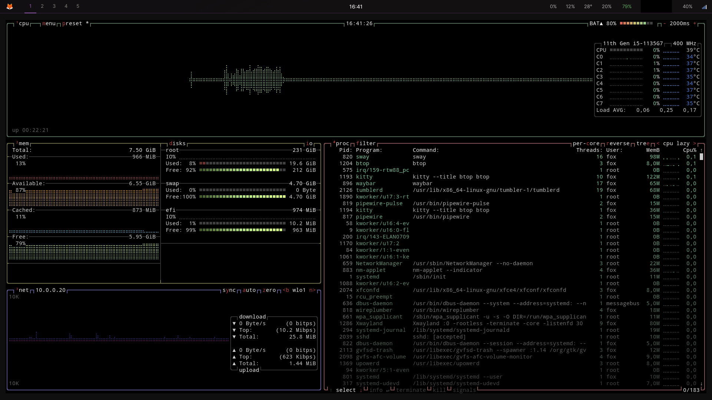

<div align="center">


</div>

# SnowFoxOS v2.0

<div align="center">

**A minimal, fast Wayland desktop built on Debian 12**


</div>

---

## Overview

SnowFoxOS is a one-script installer that transforms a minimal Debian 12 installation into a polished, performance-focused Wayland desktop. No bloat, no display manager, no unnecessary services — just a clean Sway environment that gets out of your way.


---

## Features

- **Sway** — tiling Wayland compositor with smart gaps and per-window floating rules
- **Waybar** — minimal status bar with CPU, RAM, battery, network and audio
- **Wofi** — fast app launcher with a matching dark theme
- **Kitty** — GPU-accelerated terminal
- **Brave** — privacy-focused browser, Firefox removed
- **PipeWire** — modern audio stack, PulseAudio removed
- **Dunst** — lightweight notification daemon
- **zram** — compressed swap in RAM (lz4, 50%), swappiness tuned to 10
- **GPU auto-detection** — installs the right drivers for AMD, Nvidia, or hybrid setups automatically
- **Dark mode** — GTK3 + GTK4 Adwaita-dark out of the box

---

## Performance

SnowFoxOS is tuned to stay out of the way and use as little resources as possible.

- zram with lz4 compression replaces traditional swap — faster and RAM-efficient
- `vm.swappiness=10` keeps data in RAM as long as possible
- Unnecessary system services are disabled on install (cups, avahi, ModemManager, and more)
- No display manager — Sway starts directly from TTY1
- Boot to desktop in under 2 seconds




---

## Installation

**Requirements:** A fresh Debian 12 (Bookworm) minimal install with a non-root user.

```bash
git clone https://github.com/Xr7-Code/SnowFoxOS-v2.git
cd SnowFoxOS-v2
sudo ./install.sh
sudo reboot
```

After reboot, log in at TTY1 — Sway starts automatically.

---

## Keyboard Shortcuts

| Shortcut | Action |
|---|---|
| `Super + Return` | Terminal (Kitty) |
| `Super + Space` | App launcher (Wofi) |
| `Super + B` | Brave Browser |
| `Super + E` | File manager (Thunar) |
| `Super + L` | Lock screen |
| `Super + Q` | Close window |
| `Super + Shift + E` | Power menu |
| `Super + Shift + R` | Reload Sway config |
| `Print` | Screenshot |
| `Super + Print` | Area screenshot |

---

## Stack

| Component | Package |
|---|---|
| Compositor | sway |
| Status bar | waybar |
| App launcher | wofi |
| Terminal | kitty |
| Browser | brave |
| Audio | pipewire + wireplumber |
| Notifications | dunst |
| File manager | thunar |
| Screen lock | swaylock |
| Idle manager | swayidle |

---

## Screenshots

Screenshots were taken with `grim` — already included in the installation.

```bash
# Full screenshot
grim ~/Pictures/screenshot.png

# Area selection
grim -g "$(slurp)" ~/Pictures/screenshot.png
```

---

<div align="center">
<sub>Built by Xr7-Code on Debian 12</sub>
</div>
